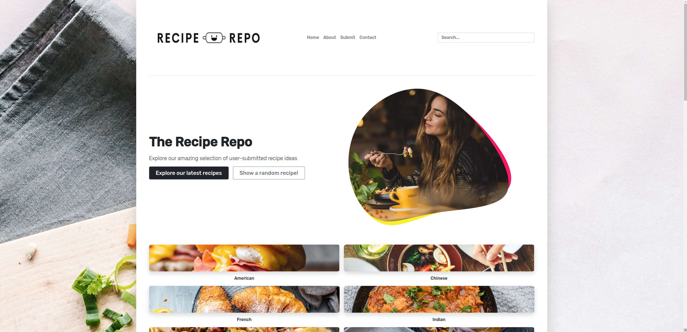

# Recipe Repo

## Description

<p>Post and view your recipes online with <b>Recipe Repo!</b></p>
<p>Full-stack application built using JavaScript, Express, NodeJS, Bootstrap, EJS and MongoDB.</p>

## Preview

<p>Main Page</p>

<p>Main Page Continued</p>

<p>Submission Form</p>

<p>Latest Recipes</p>

<p>Explore Categories</p>


### Tech stack

```
Core:
- JavaScript
- Node.JS
- Express
- Bootstrap
- EJS
- MongoDB
- Mongoose
```

## Available Scripts

In the project directory, open the app with:

### `npm start`

Open [http://localhost:3000](http://localhost:3000) to view it in your browser.

The page will reload when you make changes.\
You may also see any lint errors in the console.
